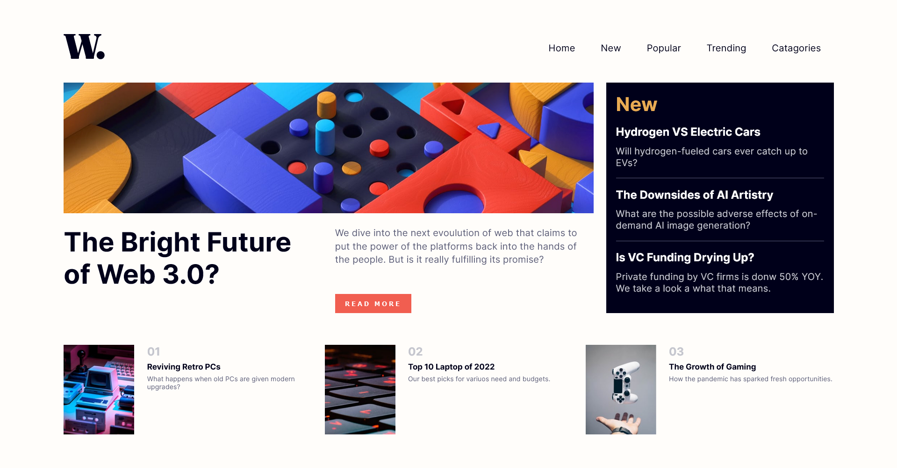

# Frontend Mentor - News Homepage Main Solution

This is a solution to the [News Homepage Challange](https://www.frontendmentor.io/challenges/news-homepage-H6SWTa1MFl). Frontend Mentor challenges help you improve your coding skills by building realistic projects. 

## Table of contents

- [Overview](#overview)
  - [The challenge](#the-challenge)
  - [Screenshot](#screenshot)
  - [Links](#links)
  - [Built with](#built-with)

## Overview

### The challenge

Users should be able to:

- View the optimal layout for the interface depending on their device's screen size
- See hover and focus states for all interactive elements on the page

### Screenshot

- Desktop:  

- Mobile:    

- Menu [In Mobile view]

### Links

- Live Site URL: https://khalidmahamud.github.io/news-homepage-main/

### Built with

- Semantic HTML5 markup
- CSS custom properties
- Flexbox
- JavaScript DOM manupulation

